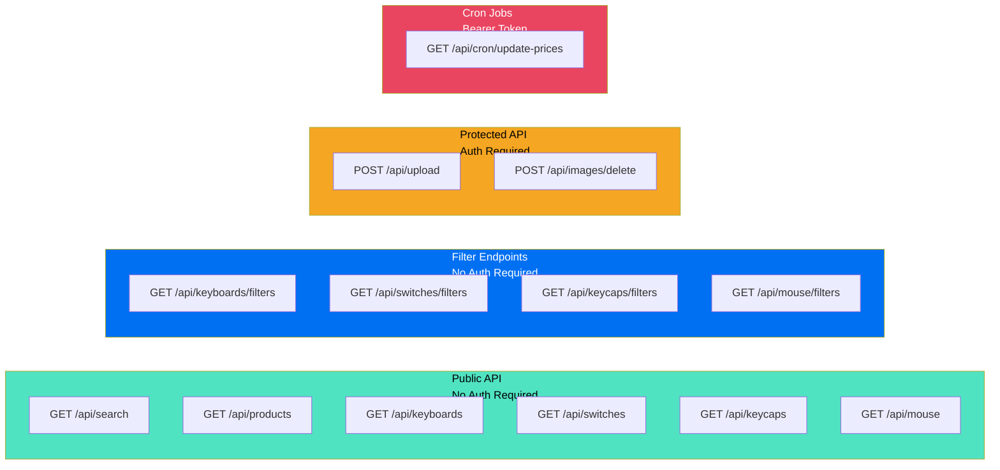
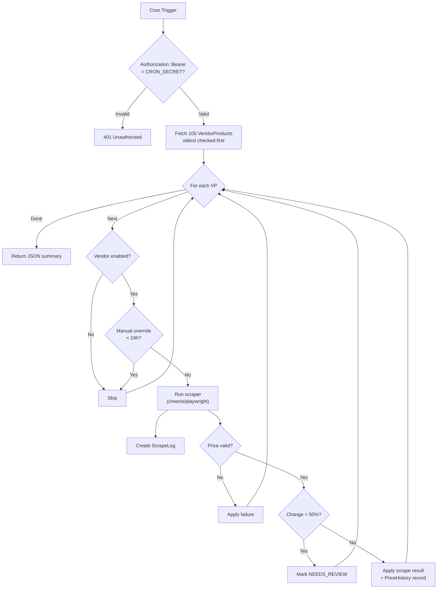

# API Reference

## Purpose

This document describes all API routes and server actions in the KeyDir application.

## API Routes Overview



## Product Listing Endpoints

### GET /api/products

**Purpose:** Fetch keyboard product listings with filtering, sorting, and pagination.

**Auth:** None (public)

**Parameters:**

| Param | Type | Default | Description |
|-------|------|---------|-------------|
| `q` | string | — | Search query |
| `sort` | string | `popular` | Sort: `lowest`, `highest`, `newest`, `popular`, `vendors` |
| `page` | number | 1 | Page number |
| `pageSize` | number | 24 | Items per page |
| `layout` | string[] | — | Filter by keyboard layout |
| `caseMaterial` | string[] | — | Filter by case material |
| `priceMin` | number | — | Minimum effective price |
| `priceMax` | number | — | Maximum effective price |
| *various* | string[] | — | Dynamic spec-based filters |

**Response `200`:**
```json
{
  "products": [
    {
      "id": "string",
      "name": "string",
      "slug": "string",
      "image": "string",
      "brand": { "name": "string", "slug": "string" },
      "effectivePrice": 15000,
      "vendorCount": 5,
      "upvotes": 42,
      "downvotes": 3,
      "approval": 93.3
    }
  ],
  "total": 100,
  "page": 1,
  "pageSize": 24,
  "totalPages": 5
}
```

**Cache:** `public, s-maxage=600, stale-while-revalidate=300`

---

### GET /api/keyboards

Same as `/api/products` but explicitly filtered to `productType: 'keyboards'`.

---

### GET /api/switches

**Purpose:** Fetch switch product listings.

**Auth:** None (public)

**Parameters:** Same as `/api/products`. Default sort: `popular`.

**Cache:** `public, s-maxage=600, stale-while-revalidate=300`

---

### GET /api/keycaps

**Purpose:** Fetch keycap product listings.

**Auth:** None (public)

**Parameters:** Same as `/api/products`. Default sort: `popular`.

**Cache:** `public, s-maxage=600, stale-while-revalidate=300`

---

### GET /api/mouse

**Purpose:** Fetch mouse product listings.

**Auth:** None (public)

**Parameters:** Same as `/api/products`. Default sort: `popular`.

**Cache:** `public, s-maxage=600, stale-while-revalidate=300`

---

## Filter Endpoints

### GET /api/keyboards/filters

**Purpose:** Fetch available filter options for the keyboards category.

**Auth:** None (public)

**Response `200`:**
```json
{
  "brands": ["Brand A", "Brand B"],
  "vendors": ["Vendor X", "Vendor Y"],
  "specs": {
    "layout": ["60%", "65%", "75%", "TKL", "Full-size"],
    "caseMaterial": ["Aluminum", "Plastic", "Carbon Fiber"],
    "flexCuts": [true, false]
  },
  "priceMin": 1500,
  "priceMax": 50000
}
```

**Cache:** `public, s-maxage=3600, stale-while-revalidate=86400`

---

### GET /api/switches/filters

Same pattern as keyboards filters, returning switch-specific filter options.

**Cache:** `public, s-maxage=3600, stale-while-revalidate=86400`

---

### GET /api/keycaps/filters

Same pattern, returning keycap-specific filter options.

**Cache:** `public, s-maxage=3600, stale-while-revalidate=86400`

---

### GET /api/mouse/filters

Same pattern, returning mouse-specific filter options.

**Cache:** `public, s-maxage=3600, stale-while-revalidate=86400`

---

## Search

### GET /api/search

**Purpose:** Global search across products, vendors, and brands.

**Auth:** None (public)

**Parameters:**

| Param | Type | Required | Description |
|-------|------|----------|-------------|
| `q` | string | Yes | Search query (minimum 2 characters) |

**Response `200`:**
```json
{
  "products": [
    {
      "name": "Product Name",
      "slug": "product-slug",
      "image": "https://res.cloudinary.com/...",
      "brand": "Brand Name",
      "category": "keyboards",
      "categorySlug": "keyboards"
    }
  ],
  "vendors": [
    { "name": "Vendor Name", "slug": "vendor-slug" }
  ],
  "brands": [
    { "name": "Brand Name", "slug": "brand-slug" }
  ]
}
```

**Limits:** 8 products, 5 vendors, 5 brands.

**Behavior:** Returns empty arrays when query is missing, empty, or fewer than 2 characters.

**Cache:** `public, s-maxage=120, stale-while-revalidate=600`

---

## Image Endpoints

### POST /api/upload

**Purpose:** Upload an image to Cloudinary.

**Auth:** Required (Supabase authenticated user)

**Request:** `multipart/form-data`

| Field | Type | Required | Description |
|-------|------|----------|-------------|
| `file` | File | Yes | Image file (max 10MB) |
| `dir` | string | No | Cloudinary subdirectory (optional) |

**Allowed MIME types:** `image/jpeg`, `image/png`, `image/webp`, `image/avif`

**Response `200`:**
```json
{
  "url": "https://res.cloudinary.com/cloud-name/image/upload/v1/products/abc123",
  "publicId": "products/abc123",
  "width": 800,
  "height": 600,
  "format": "webp"
}
```

**Error Responses:**

| Status | Condition |
|--------|-----------|
| `400` | No file provided |
| `400` | File too large (max 10MB) |
| `400` | Invalid file type |
| `401` | Not authenticated |
| `500` | Upload failed (Cloudinary error) |

---

### POST /api/images/delete

**Purpose:** Delete an image from Cloudinary.

**Auth:** Required (Supabase authenticated user + admin role)

**Request:** `application/json`

```json
{
  "publicId": "products/abc123"
}
```

**Response `200`:**
```json
{
  "ok": true
}
```

**Error Responses:**

| Status | Condition |
|--------|-----------|
| `400` | `publicId` is required |
| `401` | Not authenticated |
| `403` | Not an admin |
| `500` | Delete failed |

---

## Cron Jobs

### GET /api/cron/update-prices

**Purpose:** Automated price scraping from vendor websites. Fetches vendor products ordered by oldest check, scrapes prices, logs results, and flags suspicious changes.

**Auth:** Bearer token (`CRON_SECRET` environment variable)

**Schedule:** `30 21 * * *` (9:30 PM UTC daily), configured in `vercel.json`

**Flow:**



**Response `200`:**
```json
{
  "ok": true,
  "processed": 100,
  "success": 85,
  "failed": 10,
  "needsReview": 3,
  "skipped": 2,
  "errors": [
    "VendorName / ProductName: error message"
  ]
}
```

**Error Responses:**

| Status | Condition |
|--------|-----------|
| `401` | Missing or invalid `CRON_SECRET` |

---

## Votes

### GET /api/votes

**Purpose:** Placeholder — returns a "coming soon" message. Voting functionality is implemented via server actions, not this API route.

**Auth:** None (placeholder)

**Response `200`:**
```json
{
  "message": "Voting API — coming soon"
}
```

---

## Server Actions

All server actions are defined in `src/lib/admin/` and invoked via `'use server'` directives from Client Components. Each action includes authentication, input validation (Zod), and cache revalidation.

### Product Actions (`src/lib/admin/actions.ts`)

| Action | Purpose | Auth |
|--------|---------|------|
| `upsertProduct(data)` | Create or update a product | Admin |
| `deleteProduct(id, password)` | Delete a product (password confirmation) | Admin |
| `upsertBrand(data)` | Create or update a brand | Admin |
| `deleteBrand(id)` | Delete a brand (reassigns products) | Admin |

### Spec Actions (`src/lib/admin/spec-actions.ts`)

| Action | Purpose | Auth |
|--------|---------|------|
| `upsertKeyboardSpec(productId, data)` | Save keyboard specs | Admin |
| `upsertSwitchSpec(productId, data)` | Save switch specs | Admin |
| `upsertKeycapSpec(productId, data)` | Save keycap specs | Admin |
| `upsertMouseSpec(productId, data)` | Save mouse specs | Admin |

### Vendor Actions (`src/lib/admin/vendor-actions.ts`)

| Action | Purpose | Auth |
|--------|---------|------|
| `upsertVendor(data)` | Create or update a vendor | Admin |
| `toggleVendor(id)` | Enable/disable vendor | Admin |
| `updateVendorScraper(id, data)` | Update scraper configuration | Admin |
| `deleteVendor(id)` | Delete a vendor and all associated products | Admin |
| `upsertVendorProduct(data)` | Create or update a vendor product listing | Admin |
| `deleteVendorProduct(id)` | Remove a vendor product listing | Admin |
| `upsertCoupon(data)` | Create or update a coupon | Admin |
| `deleteCoupon(id)` | Remove a coupon | Admin |
| `upsertVariant(data)` | Create or update a product variant | Admin |
| `deleteVariant(id)` | Remove a variant | Admin |

### Banner Actions (`src/lib/admin/banner-actions.ts`)

| Action | Purpose | Auth |
|--------|---------|------|
| `upsertBanner(data)` | Create or update a banner | Admin |
| `toggleBanner(id)` | Enable/disable a banner | Admin |
| `duplicateBanner(id)` | Clone an existing banner as draft | Admin |
| `deleteBanner(id)` | Delete a banner | Admin |

### Scraper Actions (`src/lib/admin/scraper-actions.ts`)

| Action | Purpose | Auth |
|--------|---------|------|
| `runScraperAll()` | Scrape all enabled vendor products | Admin |
| `runScraperFailed()` | Re-scrape products with FAILED status | Admin |
| `runScraperForVendor(vendorId)` | Scrape all products for one vendor | Admin |
| `runScraperForProduct(vpId)` | Scrape a single product listing | Admin |
| `approveScrapeResult(vpId)` | Accept a NEEDS_REVIEW price change | Admin |
| `clearOverride(vpId)` | Remove manual price override | Admin |

### Profile Actions (`src/lib/profile/actions.ts`)

| Action | Purpose | Auth |
|--------|---------|------|
| `updateProfile(data)` | Update own profile settings | User |
| `voteOnProduct(productId, type)` | Upvote or downvote a product | User |
| `toggleCollection(productId)` | Add or remove product from collection | User |
| `toggleWishlist(productId)` | Add or remove product from wishlist | User |

### Auth Actions (`src/lib/auth/actions.ts`)

| Action | Purpose | Auth |
|--------|---------|------|
| `completeOAuthRegistration(data)` | Set username/password after OAuth signup | User |

### Community Actions (`src/lib/admin/community-actions.ts`)

| Action | Purpose | Auth |
|--------|---------|------|
| `resetProductVotes(productId)` | Clear all votes on a product | Admin |
| `removeVote(voteId)` | Remove a specific vote | Admin |

## Related Documents

- [Architecture](../ARCHITECTURE.md) — Request flow diagrams
- [Security](../SECURITY.md) — Authentication and authorization
- [Database](../DATABASE.md) — Data models
- [Admin](../ADMIN/) — Server action usage in admin panel
