# Architecture

## Purpose

This document describes the high-level system architecture of KeyDir, including the Next.js App Router structure, data flow, authentication, and deployment architecture.

## System Architecture

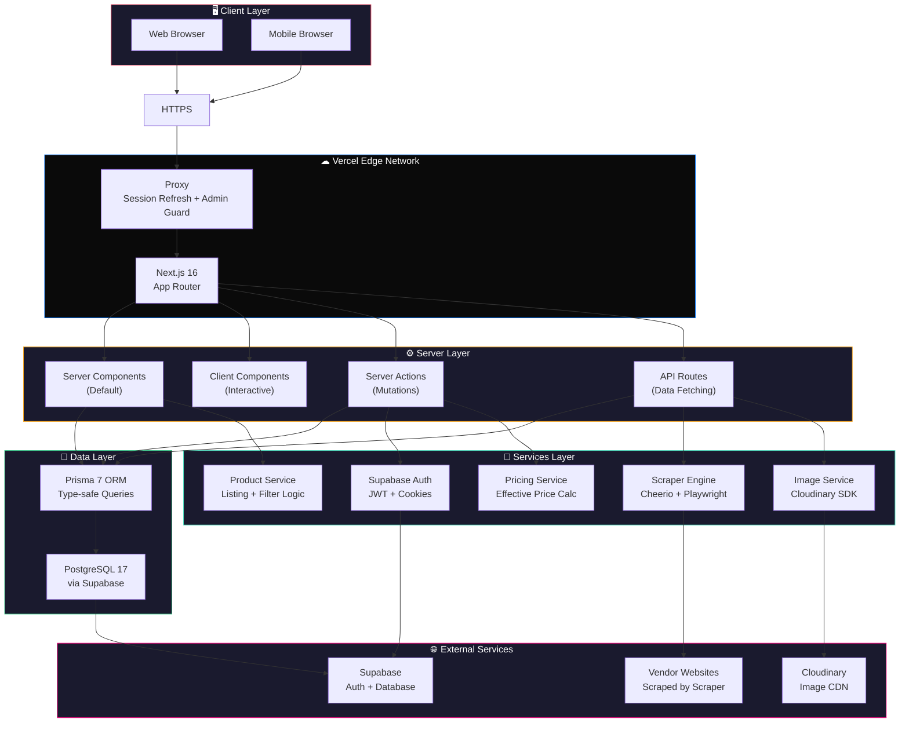

## Next.js App Router Structure

### Route Groups

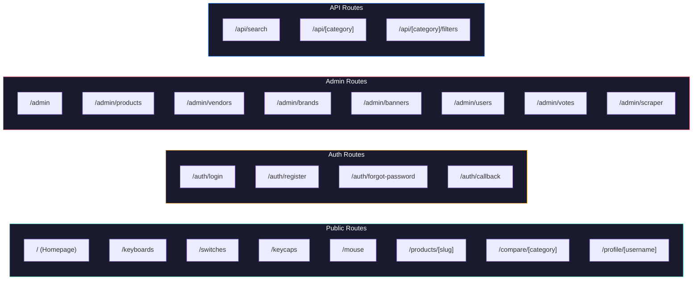

### Server vs Client Components

| Component Type | When to Use | Examples |
|---------------|-------------|----------|
| **Server Component** (default) | Data fetching, static content, SEO | Product pages, homepage, admin list pages |
| **Client Component** (`'use client'`) | Interactivity, state, browser APIs | Forms, filters, search bar, vote widget |
| **Server Action** (`'use server'`) | Data mutations (create/update/delete) | Product CRUD, vote, profile edit |
| **API Route** | Client-side data fetching | Product listings, search, filters |

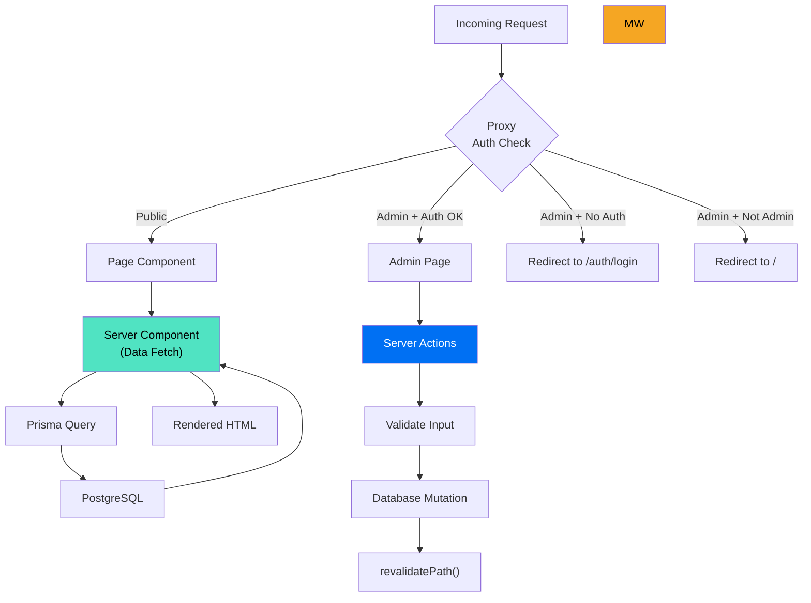

## Data Flow

### 1. Page Load (Server-Side)

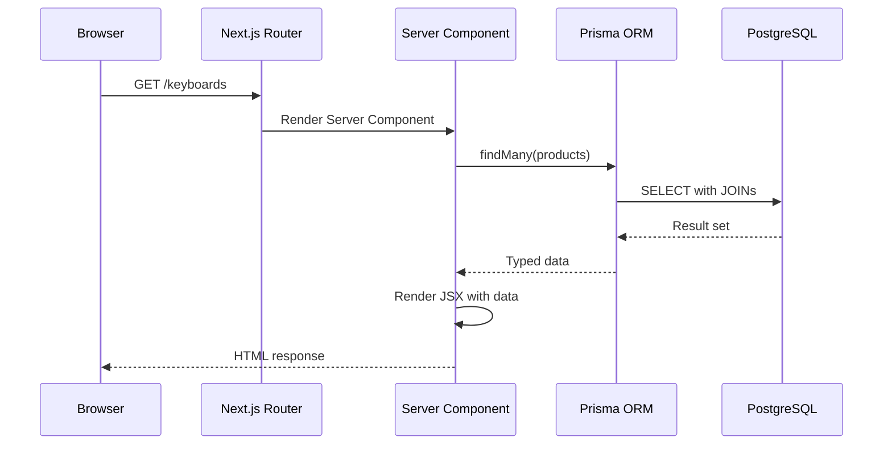

### 2. Client Interaction (Server Action)

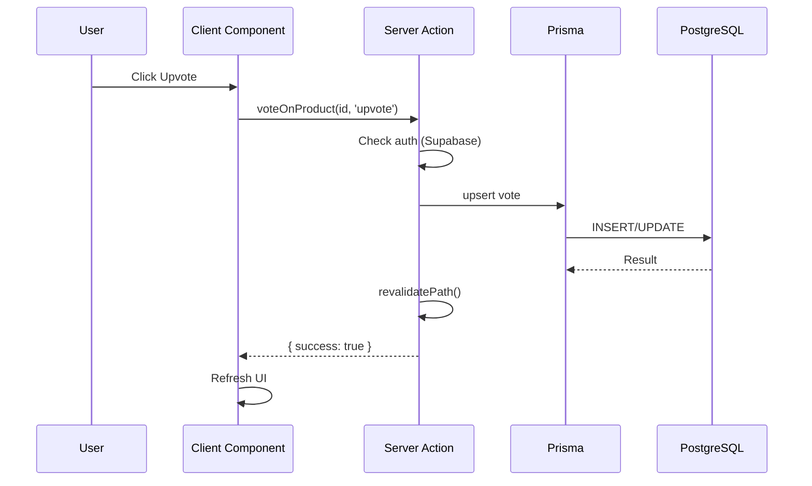

### 3. Price Scraper (Cron Job)

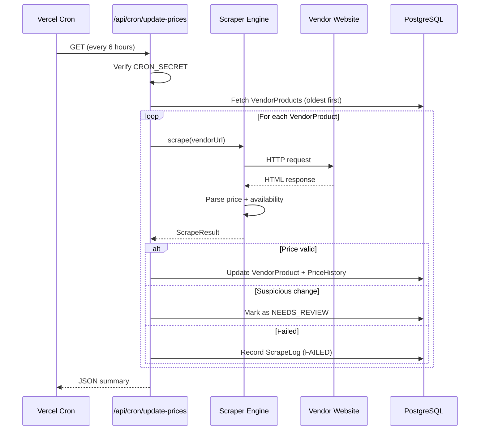

## Authentication Flow

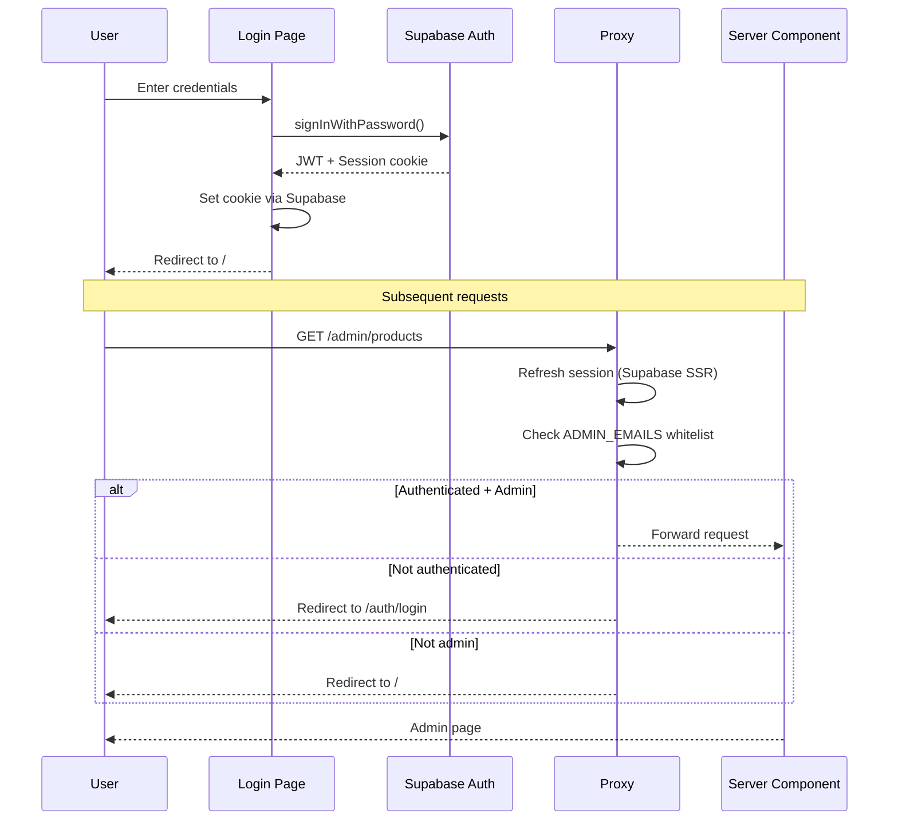

### OAuth Flow

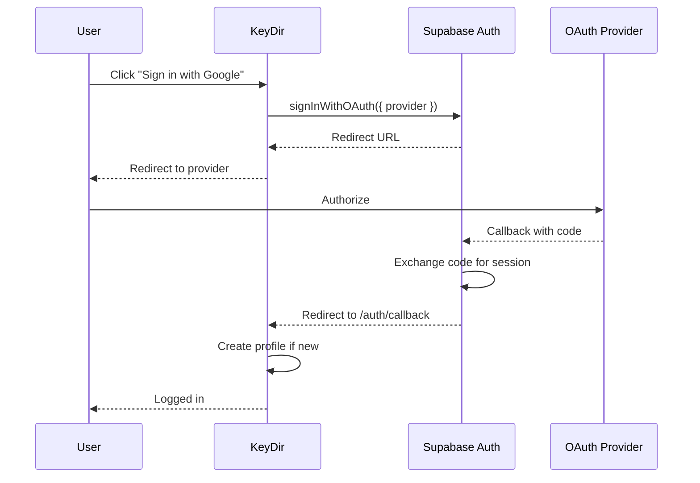

## Component Hierarchy

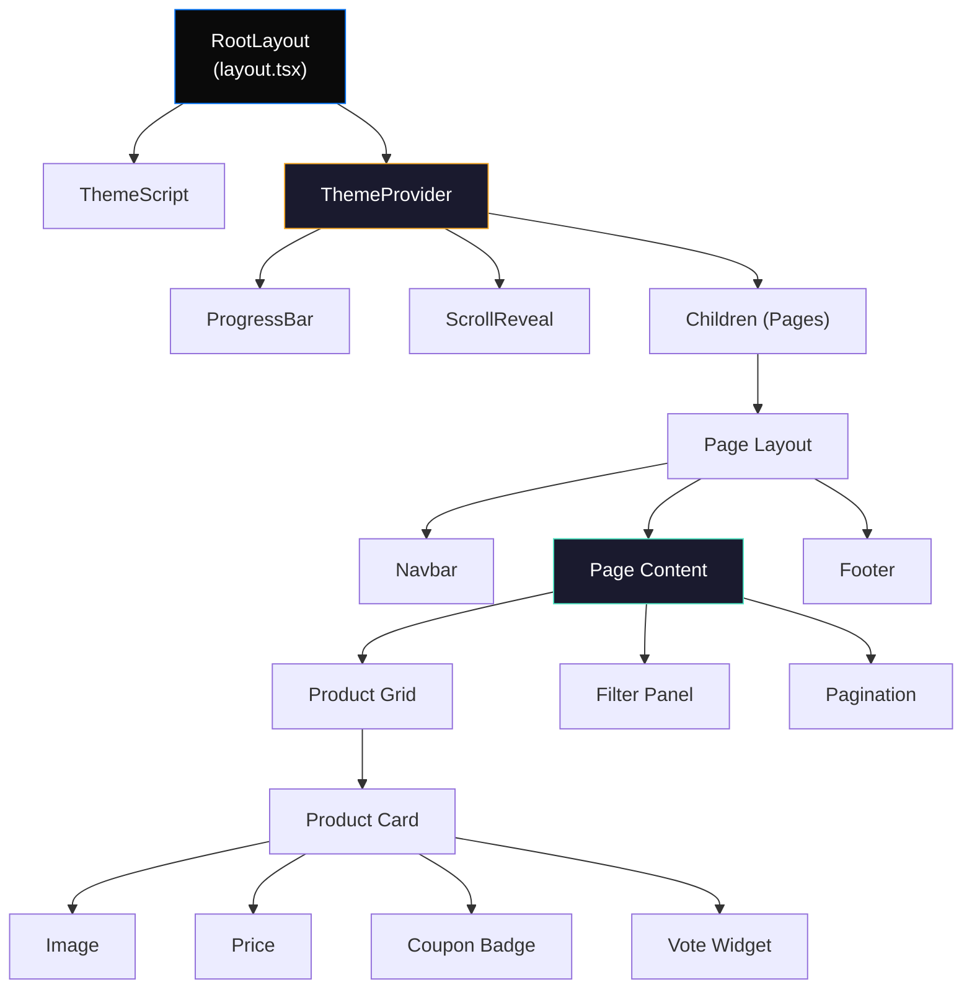

## Image Upload Flow

```mermaid
flowchart LR
    Select["User Selects Image"] --> Validate["Validate<br/>Type + Size"]
    Validate --> FormData["Create FormData"]
    FormData --> Upload["POST /api/upload"]
    Upload --> Cloudinary["Cloudinary SDK<br/>Upload"]
    Cloudinary --> URL["Return URL +<br/>publicId"]
    URL --> DB["Save to Database"]
    DB --> Display["Display Image"]

    style Select fill:#1a1a2e,stroke:#f5a623,color:#fff
    style Cloudinary fill:#1a1a2e,stroke:#3448c5,color:#fff
    style DB fill:#1a1a2e,stroke:#3ecf8e,color:#fff
```

## Deployment Architecture

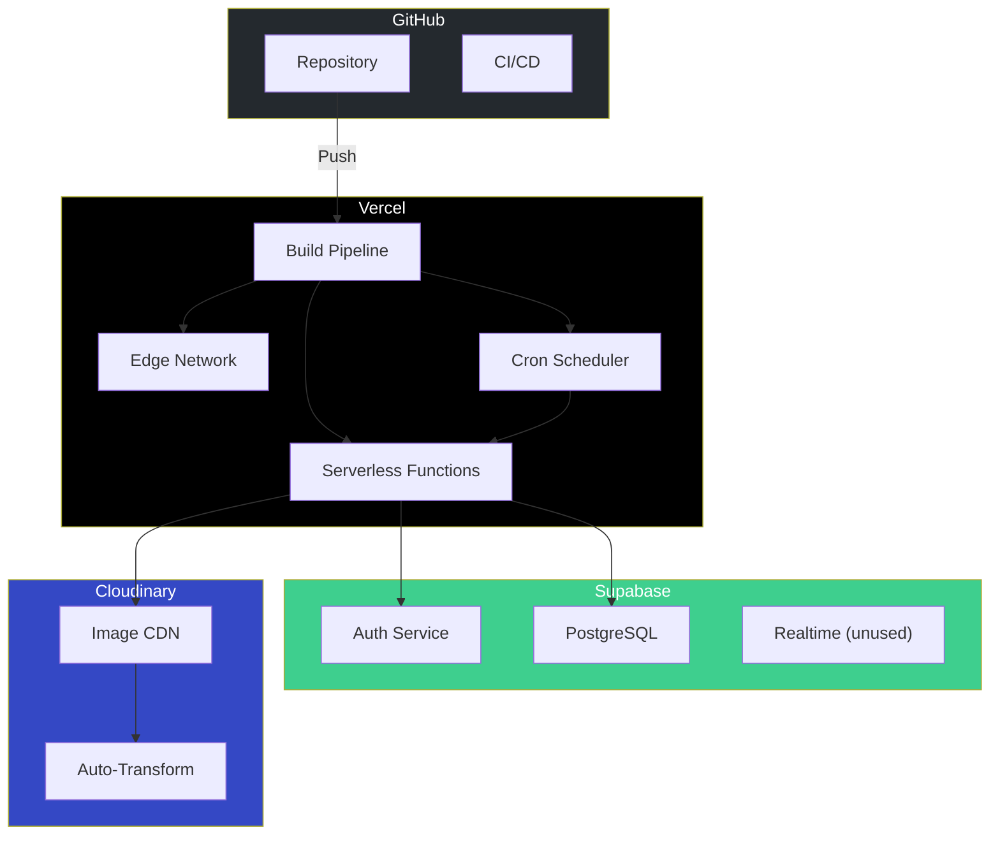

## Key Patterns

### Prisma Client Singleton

Prevents multiple Prisma instances in development (hot reload):

```typescript
const globalForPrisma = globalThis as unknown as { prisma: PrismaClient };
export const prisma = globalForPrisma.prisma || createPrismaClient();
if (process.env.NODE_ENV !== 'production') globalForPrisma.prisma = prisma;
```

### Supabase SSR Client

Cookie-based session management for server components:

```typescript
export async function createClient() {
  const cookieStore = await cookies();
  return createServerClient(url, key, {
    cookies: { getAll: () => cookieStore.getAll(), ... }
  });
}
```

### Server Action Pattern

All mutations follow this pattern:

```typescript
'use server';
export async function action(data: FormData) {
  const admin = await requireAdmin();    // Auth check
  const validated = schema.parse(data);  // Input validation
  await prisma.model.create({ data });   // Database operation
  revalidatePath('/admin/path');         // Cache invalidation
}
```

## Related Documents

- [Database](DATABASE.md) — Schema and ER diagram
- [Security](SECURITY.md) — Authentication and authorization
- [API Reference](API/) — Endpoint documentation
- [Deployment](DEPLOYMENT/) — Deployment guides
