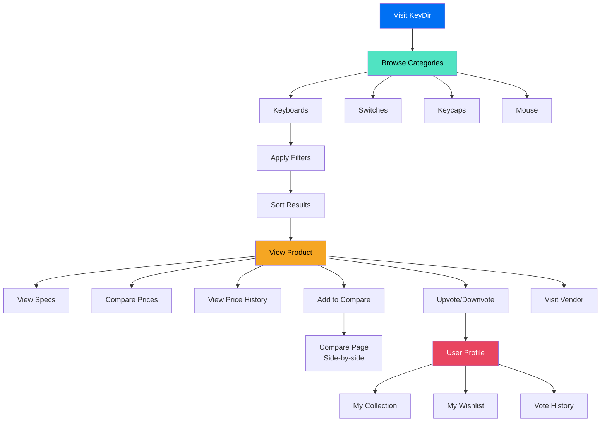
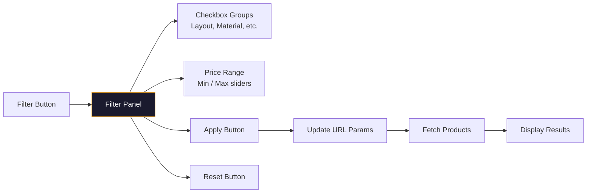
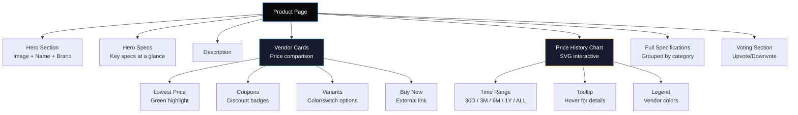
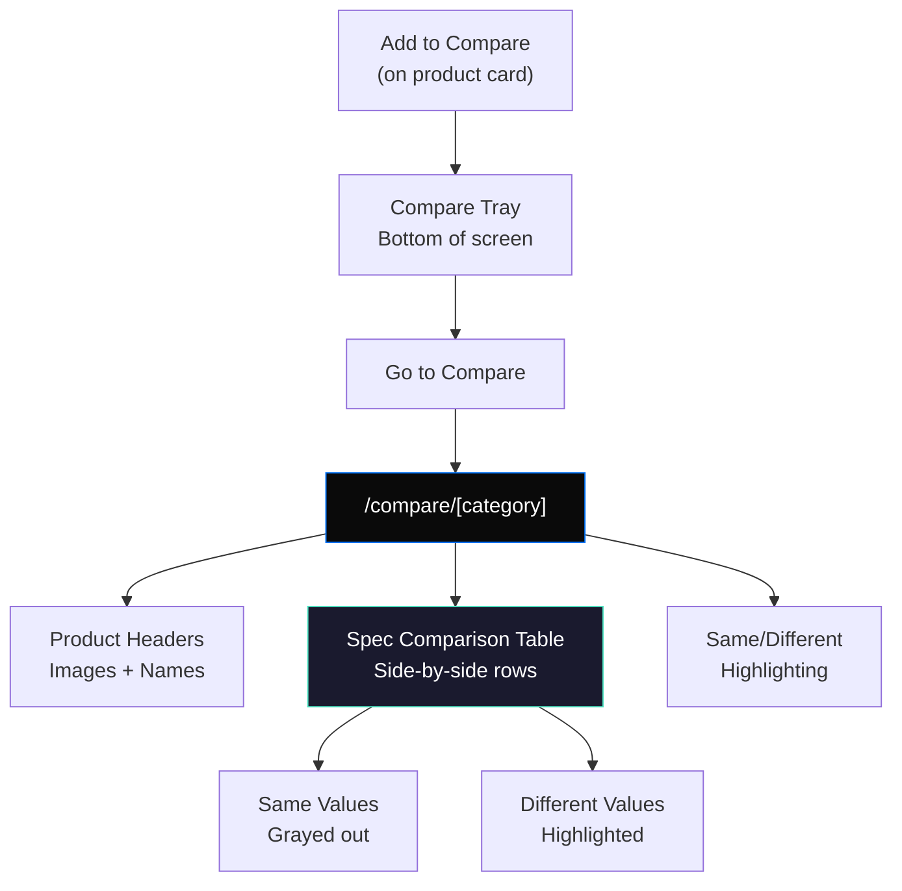
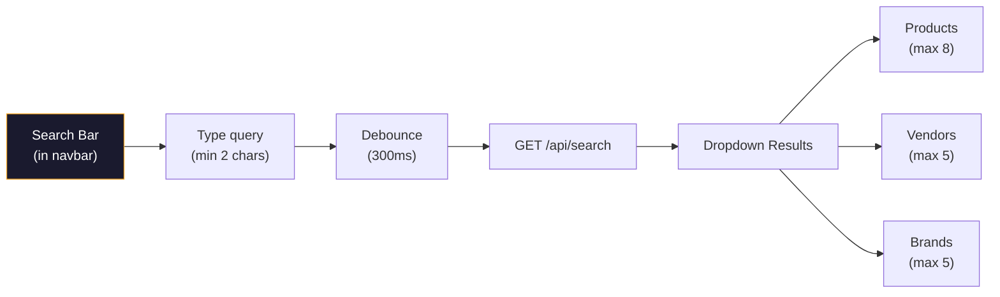
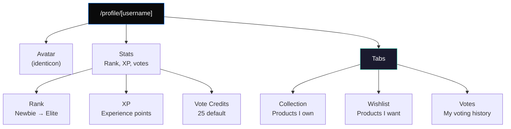
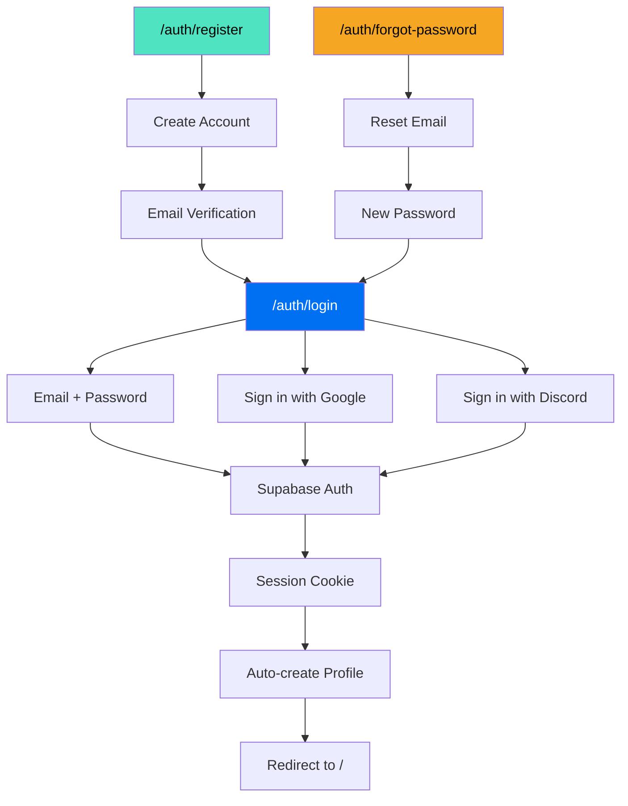

# Customer Documentation

## Purpose

This document covers the customer-facing features: browsing, comparing, searching, profiles, and authentication.

## User Journey

## Browsing Products

### Category Pages

Each category has a dedicated page with filtering and sorting:

| Category | URL | Default Sort |
|----------|-----|--------------|
| Keyboards | `/keyboards` | Most Upvoted |
| Switches | `/switches` | Most Upvoted |
| Keycaps | `/keycaps` | Most Upvoted |
| Mouse | `/mouse` | Most Upvoted |

### Filter System

### Sort Options

| Option | Value | Description |
|--------|-------|-------------|
| Lowest Price | `lowest` | Cheapest first |
| Highest Price | `highest` | Most expensive first |
| Newest | `newest` | Recently added first |
| Most Upvoted | `popular` | Highest vote count first |
| Most Vendors | `vendors` | Most vendor listings first |

### Product Card

Each product card displays:
- Product image
- Product name
- Brand name
- Lowest price (with coupon badge if applicable)
- Upvote count
- Vendor count

## Product Detail Page

### Vendor Cards

Each vendor card shows:
- Vendor name
- Price (with original price strikethrough if discounted)
- Shipping cost or "Free Shipping"
- Stock status badge
- Best coupon code and discount
- Variant options (if available)
- "Buy Now" button (links to vendor)

### Price History Chart

Interactive SVG chart with:
- **Time ranges:** 30 days, 3 months, 6 months, 1 year, All
- **Crosshair tooltip:** Hover to see exact price/date/vendor
- **Multi-vendor lines:** Each vendor gets a unique color
- **Area fill:** Semi-transparent area under each line

## Comparison Tool

### Compare Rules

- Maximum 4 products per comparison
- All products must be in the same category
- Clear the tray to switch categories

## Search

### Search Features

- Minimum 2 characters
- Debounced (300ms)
- Searches product names, vendor names, brand names
- Results grouped by type
- Click result to navigate

## User Profile

### Rank System

| Rank | XP Required | Badge |
|------|------------|-------|
| Newbie | 0 | 🌱 |
| Member | 100 | 👤 |
| Contributor | 500 | ⭐ |
| Expert | 1000 | 🏆 |
| Elite | 5000 | 👑 |

## Authentication

### Auth Pages

| Page | Route | Purpose |
|------|-------|---------|
| Login | `/auth/login` | Sign in with email/password or OAuth |
| Register | `/auth/register` | Create new account |
| Forgot Password | `/auth/forgot-password` | Request password reset |
| Verify Email | `/auth/verify-email` | Email verification confirmation |
| Account Created | `/auth/account-created` | Post-registration confirmation |

## Voting System

### How Voting Works

1. Click ▲ to upvote or ▼ to downvote
2. Click same vote to remove it
3. Click opposite vote to switch
4. Approval rating shown when total votes ≥ 10

### Community Badges

| Badge | Condition | Display |
|-------|-----------|---------|
| HIGHLY RECOMMENDED | Approval > 90% AND upvotes ≥ 100 | 🏆 Green |
| COMMUNITY FAVORITE | Approval > 80% | ⭐ Blue |

## Related Documents

- [Architecture](../ARCHITECTURE.md) — Data flow diagrams
- [API Reference](../API/) — Search and product endpoints
- [Database](../DATABASE.md) — Data models
