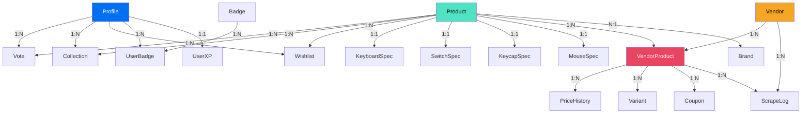

# Database

## Purpose

This document describes the KeyDir database schema, relationships, constraints, and data model. The database is PostgreSQL 17 managed by Supabase, accessed via Prisma 7 ORM.

## ER Diagram

```mermaid
erDiagram
    Profile ||--o{ Vote : "casts"
    Profile ||--o{ Collection : "owns"
    Profile ||--o{ Wishlist : "saves"
    Profile ||--o{ UserBadge : "earns"
    Profile ||--o{ UserXP : "has"
    Profile ||--o{ ReputationContribution : "creates"

    Product ||--o{ Vote : "receives"
    Product ||--o{ Collection : "in"
    Product ||--o{ Wishlist : "saved in"
    Product ||--|| KeyboardSpec : "has"
    Product ||--|| SwitchSpec : "has"
    Product ||--|| KeycapSpec : "has"
    Product ||--|| MouseSpec : "has"
    Product ||--o{ VendorProduct : "listed at"
    Product }o--|| Brand : "made by"

    Vendor ||--o{ VendorProduct : "sells"
    Vendor ||--o{ ScrapeLog : "generates"
    VendorProduct ||--o{ PriceHistory : "tracked"
    VendorProduct ||--o{ Variant : "has"
    VendorProduct ||--o{ Coupon : "offers"
    VendorProduct ||--o{ ScrapeLog : "logged"

    Badge ||--o{ UserBadge : "awarded to"
    Banner ||--o{ BannerView : "viewed"
    Banner ||--o{ BannerClick : "clicked"

    Profile {
        string id PK
        string userId UK
        string username UK
        string displayName
        string bio
        string avatarUrl
        json socialLinks
        int voteCredits
        string rank
        datetime createdAt
        datetime updatedAt
    }

    Product {
        string id PK
        string name
        string slug UK
        string productType
        string description
        string image
        string brandId FK
        datetime createdAt
        datetime updatedAt
    }

    Brand {
        string id PK
        string name
        string slug UK
        string logo
        string website
        string country
    }

    Vendor {
        string id PK
        string name
        string slug UK
        string website
        string affiliateLink
        string logo
        string shippingPolicy
        boolean enabled
        boolean scraperEnabled
        string scraperEngine
        string chartColor
        json scraperConfig
        datetime createdAt
        datetime updatedAt
    }

    VendorProduct {
        string id PK
        string productId FK
        string vendorId FK
        string vendorUrl
        decimal price
        decimal shippingCost
        boolean shippingIncluded
        decimal totalPrice
        decimal effectivePrice
        string stockStatus
        string availability
        string scrapeStatus
        string scrapeError
        datetime lastCheckedAt
        datetime lastSuccessfulAt
        boolean manualOverride
        datetime manualUpdatedAt
        int responseTimeMs
        string scraperVersion
    }

    KeyboardSpec {
        string id PK
        string productId FK
        string layout
        json keyboardStyle
        string caseMaterial
        json surfaceFinish
        json colors
        float weight
        float lengthMm
        float widthMm
        float heightMm
        float typingAngle
        json mountingStyle
        json plateMaterial
        json stabilizerCompat
        json connectivity
        json firmware
        string lighting
        boolean perKeyRgb
        json switchCompat
        json switchType
        boolean factoryLubed
        float switchOpForce
        float switchBottomOut
    }

    SwitchSpec {
        string id PK
        string productId FK
        json switchType
        json switchCompat
        boolean factoryLubed
        float switchOpForce
        float switchBottomOut
        float switchPreTravel
        float switchTotalTravel
    }

    KeycapSpec {
        string id PK
        string productId FK
        json keycapProfile
        json keycapMaterial
        json keycapManufacturing
        json keycapLegends
    }

    MouseSpec {
        string id PK
        string productId FK
        json mouseConnection
        string mouseSensor
        int mouseDpi
        float mouseWeight
        string mouseShape
    }

    Vote {
        string id PK
        string profileId FK
        string productId FK
        string type
        datetime createdAt
    }

    PriceHistory {
        string id PK
        string vendorProductId FK
        decimal price
        string availability
        datetime recordedAt
    }

    Variant {
        string id PK
        string vendorProductId FK
        string name
        decimal price
        string stockStatus
        json color
        json switches
        string variantUrl
    }

    Coupon {
        string id PK
        string vendorProductId FK
        string code
        string discountType
        decimal discountValue
        string couponUrl
        boolean enabled
        datetime expiresAt
    }

    ScrapeLog {
        string id PK
        string vendorId FK
        string vendorProductId FK
        string status
        int httpStatus
        int responseTimeMs
        string error
        decimal price
        string availability
        string selectorVersion
        datetime createdAt
    }

    Banner {
        string id PK
        string title
        string desktopImage
        string mobileImage
        string linkUrl
        string linkType
        json targetLocations
        int priority
        boolean active
        datetime startDate
        datetime endDate
    }

    Badge {
        string id PK
        string name
        string slug
        string description
        string icon
        string color
        string category
    }

    UserBadge {
        string id PK
        string profileId FK
        string badgeId FK
        datetime awardedAt
    }

    UserXP {
        string id PK
        string profileId FK
        int totalXP
        int level
        datetime lastUpdated
    }
```



## Table Descriptions

### Core Entities

| Table | Description | Key Fields |
|-------|-------------|------------|
| **Profile** | User profile with stats and social links | `userId` (FK → Supabase auth), `username`, `rank` |
| **Product** | Central product entity (keyboards, switches, etc.) | `productType` (string, not FK), `slug` (unique), `brandId` |
| **Brand** | Product manufacturer/brand | `name`, `slug`, `logo`, `country` |
| **Vendor** | Indian vendor/seller | `enabled`, `scraperEnabled`, `scraperEngine`, `chartColor` |

### Product Specs (One-to-One)

| Table | Description | Linked To |
|-------|-------------|-----------|
| **KeyboardSpec** | Keyboard-specific specifications | Product (1:1) |
| **SwitchSpec** | Switch-specific specifications | Product (1:1) |
| **KeycapSpec** | Keycap-specific specifications | Product (1:1) |
| **MouseSpec** | Mouse-specific specifications | Product (1:1) |

### Vendor Pricing

| Table | Description | Key Fields |
|-------|-------------|------------|
| **VendorProduct** | Product listing at a specific vendor | `price`, `effectivePrice`, `stockStatus`, `scrapeStatus` |
| **PriceHistory** | Historical price records | `price`, `recordedAt` |
| **Variant** | Product variants (color, switches) | `name`, `price`, `color`, `switches` |
| **Coupon** | Discount codes | `code`, `discountType`, `discountValue`, `enabled` |

### Community

| Table | Description | Key Fields |
|-------|-------------|------------|
| **Vote** | User votes on products | `type` ('upvote'/'downvote'), unique per user+product |
| **Collection** | Products users own | `profileId` + `productId` unique |
| **Wishlist** | Products users want | `profileId` + `productId` unique |
| **Badge** | Achievement badges | `name`, `category`, `color` |
| **UserBadge** | Badges earned by users | `profileId` + `badgeId` unique |
| **UserXP** | Experience points | `totalXP`, `level` |

### Scraper

| Table | Description | Key Fields |
|-------|-------------|------------|
| **ScrapeLog** | Scraping execution logs | `status`, `httpStatus`, `error`, `price` |

### CMS

| Table | Description | Key Fields |
|-------|-------------|------------|
| **Banner** | Promotional banners | `targetLocations`, `priority`, `active`, date range |
| **BannerView** | Banner view tracking | `bannerId`, `ipAddress`, `userAgent` |
| **BannerClick** | Banner click tracking | `bannerId`, `ipAddress` |

## Relationships



## Constraints

### Unique Constraints

| Table | Fields | Purpose |
|-------|--------|---------|
| Profile | `userId` | One profile per Supabase user |
| Profile | `username` | Unique display URL |
| Product | `slug` | SEO-friendly URL |
| Brand | `slug` | SEO-friendly URL |
| Vendor | `slug` | SEO-friendly URL |
| Vote | `profileId` + `productId` | One vote per user per product |
| Collection | `profileId` + `productId` | One entry per user per product |
| Wishlist | `profileId` + `productId` | One entry per user per product |
| UserBadge | `profileId` + `badgeId` | One badge per user |

### Foreign Key Constraints

All foreign keys use `onDelete: Cascade` for:
- Vote → Profile, Product
- Collection → Profile, Product
- Wishlist → Profile, Product
- VendorProduct → Vendor, Product
- PriceHistory → VendorProduct
- Variant → VendorProduct
- Coupon → VendorProduct
- ScrapeLog → Vendor, VendorProduct
- UserBadge → Profile, Badge

### Indexes

| Table | Indexed Fields | Purpose |
|-------|---------------|---------|
| Product | `productType`, `brandId`, `slug` | Category filtering, brand lookup, URL routing |
| VendorProduct | `productId`, `vendorId`, `effectivePrice` | Price comparison, vendor filtering |
| Vote | `productId`, `profileId` | Vote counting, user vote lookup |
| PriceHistory | `vendorProductId`, `recordedAt` | Price chart queries |
| ScrapeLog | `vendorId`, `createdAt` | Scraper monitoring |

## Row Level Security (RLS)

RLS is configured in Supabase for the following tables:

| Table | Policy | Description |
|-------|--------|-------------|
| Profile | `SELECT` public | Anyone can view profiles |
| Profile | `UPDATE` owner only | Users can edit their own profile |
| Product | `SELECT` public | Anyone can view products |
| Vote | `SELECT` public | Anyone can see vote counts |
| Vote | `INSERT/DELETE` authenticated | Only logged-in users can vote |
| Collection | `SELECT` owner only | Users see only their collections |
| Wishlist | `SELECT` owner only | Users see only their wishlists |

## Database Functions

### update_effective_price()

Automatically recalculates `effectivePrice` when `price`, `shippingCost`, or `shippingIncluded` changes on VendorProduct.

```sql
CREATE OR REPLACE FUNCTION update_effective_price()
RETURNS TRIGGER AS $$
BEGIN
  NEW.effective_price := NEW.price + 
    CASE WHEN NEW.shipping_included THEN 0 ELSE NEW.shipping_cost END;
  RETURN NEW;
END;
$$ LANGUAGE plpgsql;
```

### update_updated_at()

Automatically sets `updatedAt` timestamp on row changes.

```sql
CREATE OR REPLACE FUNCTION update_updated_at()
RETURNS TRIGGER AS $$
BEGIN
  NEW.updated_at = NOW();
  RETURN NEW;
END;
$$ LANGUAGE plpgsql;
```

## Related Documents

- [Architecture](ARCHITECTURE.md) — How the database fits in the system
- [Security](SECURITY.md) — RLS policies and access control
- [API Reference](API/) — Database queries used by endpoints
