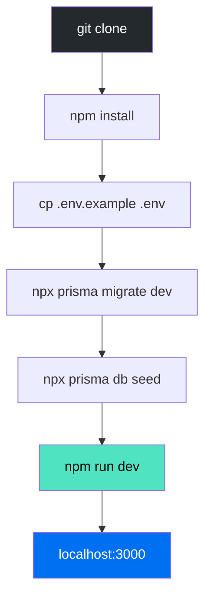
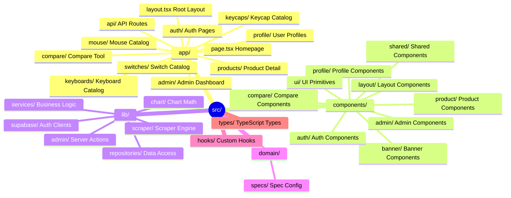

# Development Guide

## Purpose

This document covers the development workflow, component patterns, hooks, and coding conventions for KeyDir.

## Getting Started



### Prerequisites

- Node.js 20+
- npm 9+
- PostgreSQL 17 (via Supabase)
- Git

### Available Scripts

| Command | Description |
|---------|-------------|
| `npm run dev` | Start development server |
| `npm run build` | Build for production |
| `npm run start` | Start production server |
| `npm run lint` | Run ESLint |

## Project Structure



## Component Patterns

### Server Components (Default)

All components are Server Components by default. They run on the server and have direct database access:

```typescript
// src/app/keyboards/page.tsx
export default async function KeyboardsPage() {
  const count = await prisma.product.count({ where: { productType: 'keyboards' } });
  return <CategoryContent totalCount={count} ... />;
}
```

### Client Components (Interactive)

Only add `'use client'` when interactivity is needed:

```typescript
// src/components/product/vote-widget.tsx
'use client';
export function VoteWidget({ productId, upvotes, downvotes }) {
  const { handleVote } = useProductVote(productId, upvotes, downvotes);
  return <button onClick={() => handleVote('upvote')}>▲</button>;
}
```

### Server Actions (Mutations)

For data mutations, use Server Actions:

```typescript
// src/lib/admin/actions.ts
'use server';
export async function upsertProduct(data: FormData) {
  const admin = await requireAdmin();
  if (!admin) throw new Error('Unauthorized');
  
  const validated = schema.parse(Object.fromEntries(data));
  await prisma.product.upsert({ ... });
  revalidatePath('/admin/products');
}
```

## Custom Hooks

| Hook | File | Purpose |
|------|------|---------|
| `useCatalogFilters` | `src/hooks/use-catalog-filters.ts` | Filter state, URL sync, price handlers |
| `useProductListing` | `src/hooks/use-product-listing.ts` | Product fetch, pagination, loading |
| `useProductVote` | `src/hooks/use-product-vote.ts` | Vote state with optimistic updates |
| `useDirtyForm` | `src/hooks/use-dirty-form.ts` | Form dirty state tracking |
| `useSpecFormState` | `src/components/admin/spec-engine.tsx` | Generic spec form state |

### Admin Hooks

| Hook | File | Purpose |
|------|------|---------|
| `useDeleteEntity` | `src/components/admin/hooks/use-delete-entity.ts` | Delete with confirmation |
| `useFormSubmit` | `src/components/admin/hooks/use-form-submit.ts` | Form submission handling |
| `useProductImages` | `src/components/admin/hooks/use-product-images.ts` | Image upload/management |
| `useVendorEntries` | `src/components/admin/hooks/use-vendor-entries.ts` | Vendor product management |
| `useVendorCardActions` | `src/components/admin/hooks/use-vendor-card-actions.ts` | Vendor card CRUD |
| `useScrollSpy` | `src/components/admin/hooks/use-scroll-spy.ts` | Section navigation |
| `usePersistentState` | `src/components/admin/hooks/use-persistent-state.ts` | localStorage-backed state |
| `useScraperTest` | `src/components/admin/hooks/use-scraper-test.ts` | Scraper test execution |
| `useSpecFormSubmit` | `src/components/admin/hooks/use-spec-form-submit.ts` | Spec form submission |

## Key Patterns

### Prisma Client Singleton

Prevents multiple instances during hot reload:

```typescript
// src/lib/prisma.ts
const globalForPrisma = globalThis as unknown as { prisma: PrismaClient };
export const prisma = globalForPrisma.prisma || createPrismaClient();
if (process.env.NODE_ENV !== 'production') globalForPrisma.prisma = prisma;
```

### Supabase SSR Client

Cookie-based session for server components:

```typescript
// src/lib/supabase/server.ts
export async function createClient() {
  const cookieStore = await cookies();
  return createServerClient(url, key, {
    cookies: { getAll: () => cookieStore.getAll(), ... }
  });
}
```

### Repository Pattern

Data access is centralized in repository files:

```typescript
// src/lib/repositories/product-repository.ts
export async function findProductBySlug(slug: string) {
  return prisma.product.findUnique({
    where: { slug },
    include: { brand: true, vendorProducts: { include: { vendor: true } } }
  });
}
```

### Spec Engine

Generic form renderer driven by `CATEGORY_SPECS` config:

```typescript
// src/components/admin/spec-engine.tsx
<SpecEngine
  groups={CATEGORY_SPECS.keyboards.groups}
  options={keyboardOptions}
  spec={existingSpec}
  onChange={() => markDirty()}
/>
```

## Coding Conventions

- Always use TypeScript (no plain `.js` files)
- Never use `any` — use `unknown` and narrow with type guards
- Always use Prisma ORM — no raw SQL queries
- Server Components by default — only add `'use client'` when interactivity is needed
- Validate all user inputs with Zod schemas in server actions
- Never hardcode colors — use CSS variables defined in `globals.css`
- Reuse existing components — check before creating new ones
- Use `@/` path alias for imports from `src/`

## Common Tasks

### Adding a New Product Category

1. Add the category to `Product.productType` in `schema.prisma`
2. Create a spec model (e.g., `GamingMouseSpec`)
3. Add to `CATEGORY_SPECS` in `src/domain/specs/category-specs.ts`
4. Create pages under `src/app/[category]/`
5. Create API routes under `src/app/api/[category]/`
6. Add to `PRODUCT_CATEGORIES` in `src/lib/admin/product-categories.ts`

### Adding a New Admin Feature

1. Create the page under `src/app/admin/[feature]/page.tsx`
2. Add server actions under `src/lib/admin/`
3. Create components under `src/components/admin/`
4. Update the admin sidebar navigation

## Related Documents

- [Contributing](../CONTRIBUTING.md) — Coding rules and conventions
- [Architecture](../ARCHITECTURE.md) — System design
- [API Reference](../API/) — Endpoint documentation
