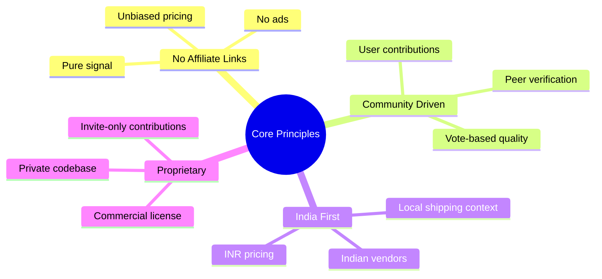
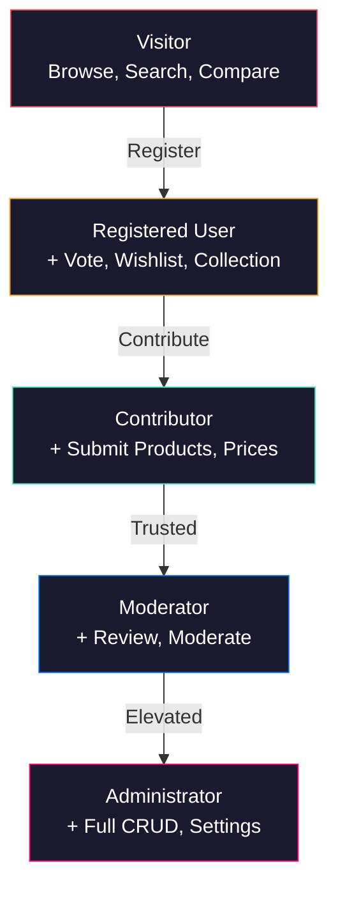
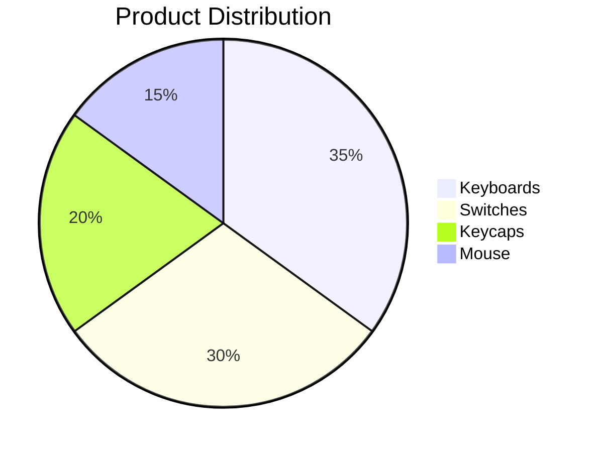
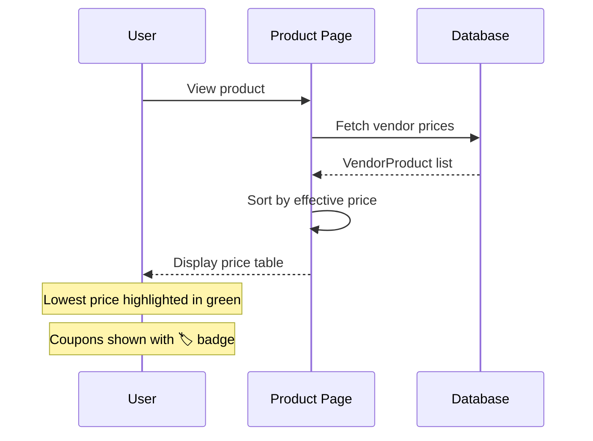
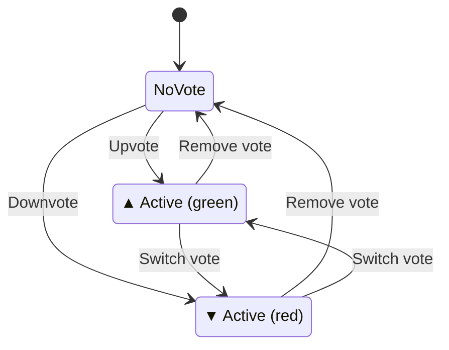

# Project Overview

## Purpose

KeyDir is the definitive community-maintained directory of mechanical keyboards, switches, keycaps, vendors, and desk peripherals available in India. It serves as a single, trusted source of truth for the Indian mechanical keyboard community.

## Vision

> Replace fragmented spreadsheets, scattered Reddit threads, and inconsistent vendor pages with one fast, searchable, unbiased directory.

### Core Principles

## User Roles

| Role | Capabilities |
|------|-------------|
| **Visitor** | Browse products, view specs, compare prices, search, view profiles |
| **Registered** | + Vote (up/down), add to wishlist/collection, edit profile |
| **Contributor** | + Submit new products, vendor listings, price updates |
| **Moderator** | + Review submissions, moderate votes, manage banners |
| **Administrator** | + Full CRUD, scraper management, system settings |

## Product Categories

| Category | Page | Filters | Description |
|----------|------|---------|-------------|
| **Keyboards** | `/keyboards` | Layout, material, mount, connectivity, PCB | Full-size, TKL, 60%, split, ortho |
| **Switches** | `/switches` | Type, feel, spring, manufacturer | Linear, tactile, clicky |
| **Keycaps** | `/keycaps` | Profile, material, legend, language | Cherry, OEM, SA, MT3 |
| **Mouse** | `/mouse` | Connectivity, sensor, DPI, weight | Gaming, ergonomic, wireless |

## Key Features

### Price Comparison

### Voting System

### Community Badges

| Badge | Condition | Display |
|-------|-----------|---------|
| **HIGHLY RECOMMENDED** | Approval > 90% AND upvotes ≥ 100 | 🏆 Green badge |
| **COMMUNITY FAVORITE** | Approval > 80% | ⭐ Blue badge |

## Success Metrics

| Metric | Target | Measurement |
|--------|--------|-------------|
| Products listed | 500+ | Database count |
| Vendors listed | 30+ | Database count |
| Monthly active users | 1,000+ | Analytics |
| Products with 3+ vendor prices | 60% | Database query |
| Average page load time | < 2s | Lighthouse |
| Community votes per month | 500+ | Database count |

## Non-Goals

| Non-Goal | Reason |
|----------|--------|
| E-commerce / direct sales | Directory, not a store |
| Affiliate links | Conflicts with unbiased mission |
| Advertising | Conflicts with unbiased mission |
| International vendor coverage | India-first focus |
| User-to-user marketplace | Out of scope |

## Related Documents

- [Architecture](ARCHITECTURE.md) — System design and data flow
- [Database](DATABASE.md) — Schema and relationships
- [Security](SECURITY.md) — Authentication and authorization
- [Changelog](CHANGELOG.md) — Release history
