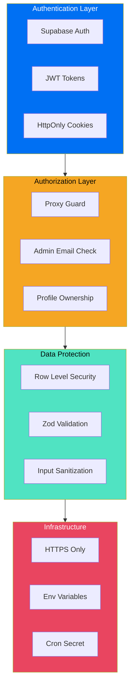
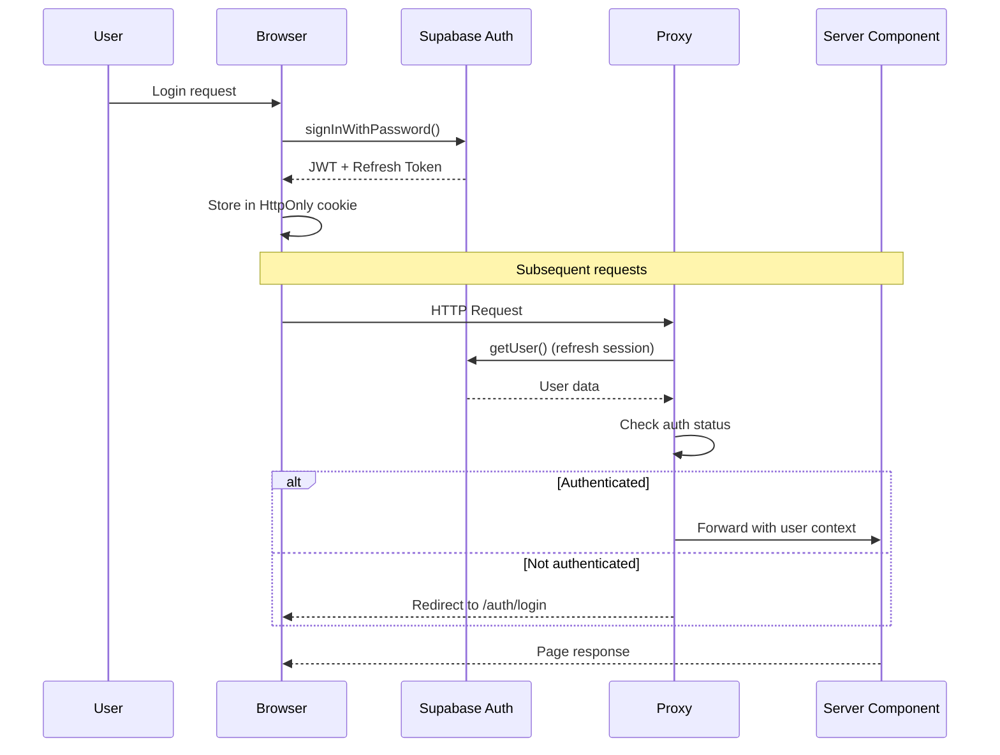
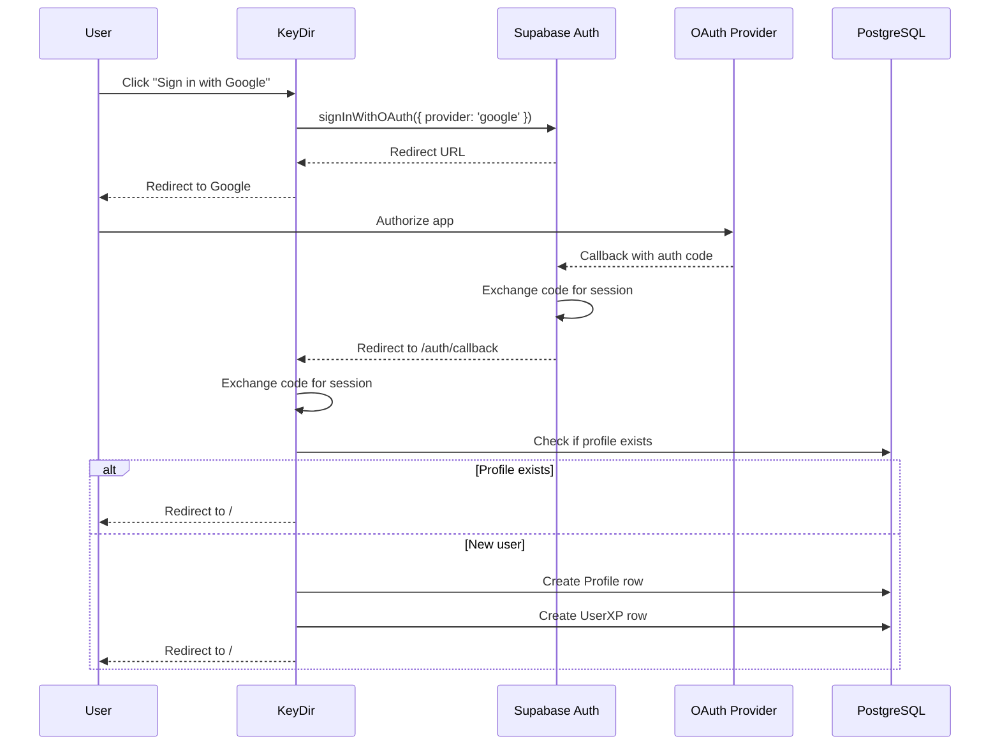
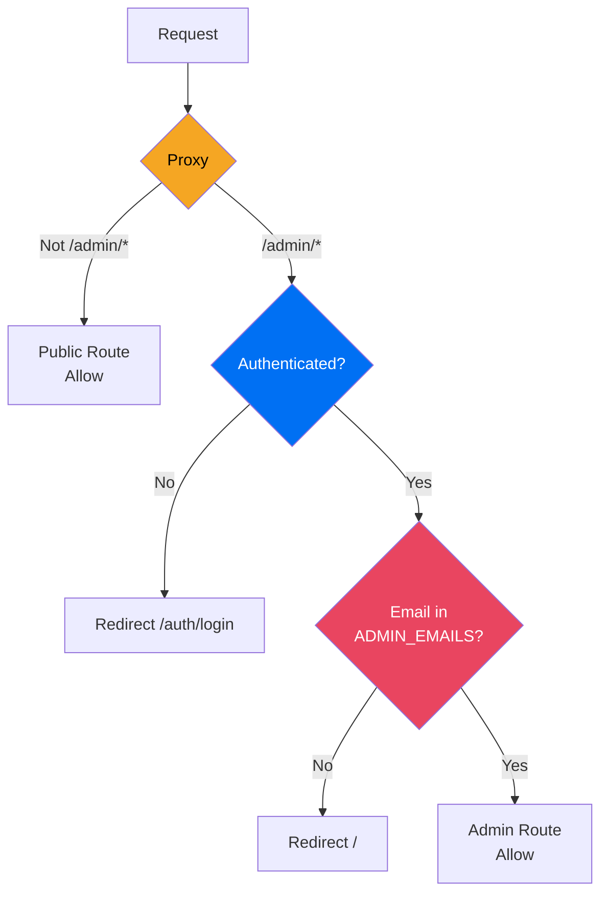
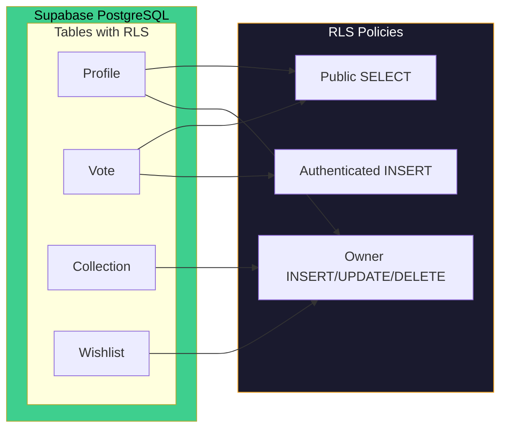
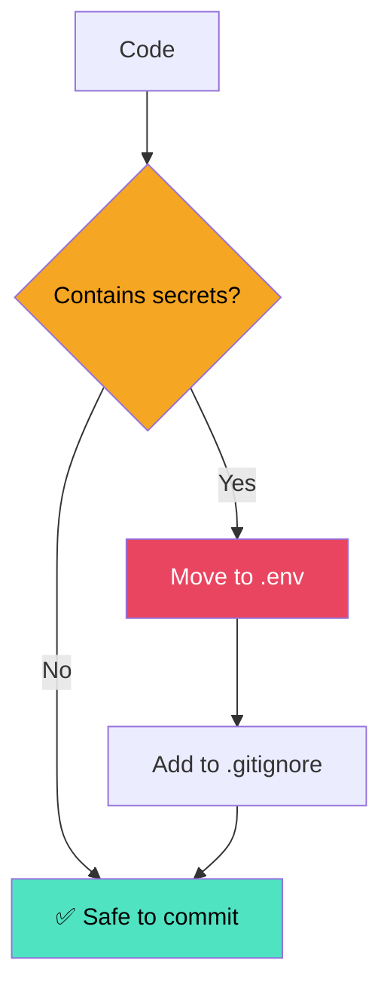
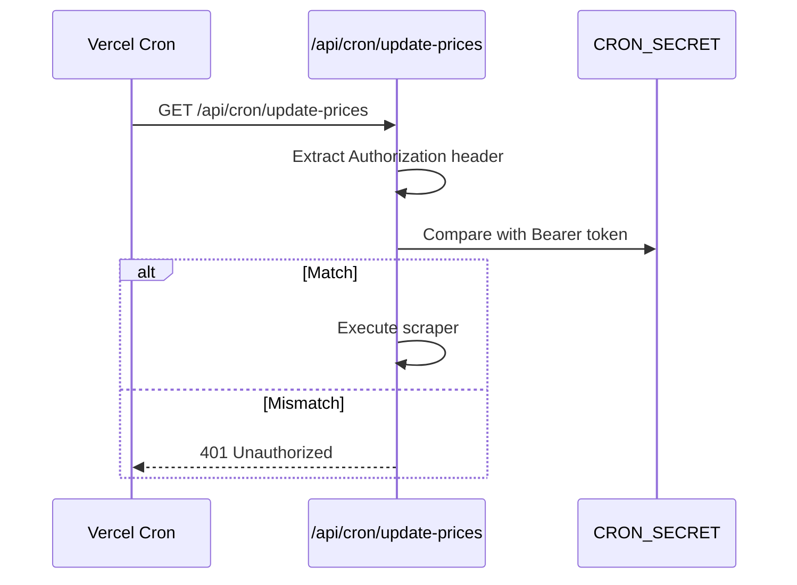

# Security

## Purpose

This document describes KeyDir's security architecture, including authentication, authorization, session management, and security best practices.

## Security Architecture



## Authentication

### Authentication Providers

| Provider | Type | Status |
|----------|------|--------|
| Email/Password | Supabase Auth | ✅ Implemented |
| Google OAuth | Supabase Auth | ✅ Implemented |
| Discord OAuth | Supabase Auth | ✅ Implemented |

### Session Flow



### OAuth Callback Flow



## Authorization

### Route Protection



### Proxy Implementation

The proxy at `src/proxy.ts` handles:

1. **Session Refresh**: Calls `supabase.auth.getUser()` to refresh the JWT on every request
2. **Admin Protection**: Checks if the user's email is in the `ADMIN_EMAILS` environment variable
3. **Cookie Management**: Properly sets/updates Supabase auth cookies

```typescript
// src/proxy.ts (simplified)
export async function proxy(request: NextRequest) {
  const supabase = createServerClient(url, key, { cookies: {...} });
  
  // Protect /admin routes
  if (path.startsWith('/admin')) {
    const { data: { user } } = await supabase.auth.getUser();
    if (!user) return redirect('/auth/login');
    
    const adminEmails = process.env.ADMIN_EMAILS.split(',');
    if (!adminEmails.includes(user.email)) return redirect('/');
  }
  
  return supabaseResponse;
}
```

### Server Action Auth Pattern

Every server action that modifies data follows this pattern:

```typescript
'use server';
export async function adminAction(data: FormData) {
  // 1. Check authentication
  const admin = await requireAdmin();
  if (!admin) throw new Error('Unauthorized');
  
  // 2. Validate input
  const validated = schema.parse(Object.fromEntries(data));
  
  // 3. Perform mutation
  await prisma.model.create({ data: validated });
  
  // 4. Invalidate cache
  revalidatePath('/admin/path');
}
```

## Data Protection

### Row Level Security (RLS)



### Input Validation

All user input is validated using Zod schemas:

```typescript
// Example: Profile update validation
export const profileSchema = z.object({
  displayName: z.string().max(50).optional(),
  bio: z.string().max(200).optional(),
  github: z.string().url().optional().or(z.literal('')),
  discord: z.string().optional(),
  reddit: z.string().optional(),
  website: z.string().url().optional().or(z.literal('')),
});
```

### File Upload Security

| Check | Implementation |
|-------|---------------|
| File size | Max 10MB enforced in API route |
| File type | Whitelist: `image/jpeg`, `image/png`, `image/webp`, `image/avif` |
| Storage | Cloudinary CDN (no local file storage) |
| Access | API route handles upload, not direct Cloudinary upload |

## Environment Variables Security

### Secret Variables (Server-Side Only)

| Variable | Risk if Exposed | Protection |
|----------|----------------|------------|
| `DATABASE_URL` | Full database access | Never in client code |
| `CLOUDINARY_API_SECRET` | Image deletion/management | Server-side only |
| `CRON_SECRET` | Unauthorized scraper runs | Bearer token validation |
| `DELETE_PASSWORD` | Product deletion | Password check in action |

### Public Variables (Safe for Client)

| Variable | Purpose |
|----------|---------|
| `NEXT_PUBLIC_SUPABASE_URL` | Supabase project URL |
| `NEXT_PUBLIC_SUPABASE_ANON_KEY` | Supabase anonymous key (RLS-protected) |
| `NEXT_PUBLIC_APP_URL` | Application base URL |

### Security Rules



## API Security

### Cron Job Authentication



### Rate Limiting

| Endpoint | Rate Limit | Protection |
|----------|-----------|------------|
| `/api/search` | Standard Vercel limits | Public |
| `/api/upload` | File size + type checks | Auth required |
| `/api/cron/*` | CRON_SECRET bearer token | Secret-based |
| Server Actions | Admin email check | Proxy + requireAdmin |

## Security Best Practices

### Checklist

- [x] No secrets in client-side code
- [x] All inputs validated with Zod
- [x] RLS enabled on sensitive tables
- [x] Admin routes protected by proxy
- [x] Server actions check authentication
- [x] File uploads validated (type + size)
- [x] Cron jobs authenticated with secret
- [x] HTTPS enforced in production
- [x] Environment variables in .gitignore
- [x] Prisma prevents SQL injection

### Never Do

- ❌ Expose `DATABASE_URL` in client code
- ❌ Skip input validation on server actions
- ❌ Trust client-side validation alone
- ❌ Log environment variables
- ❌ Commit `.env` files
- ❌ Use `any` type (bypasses type safety)
- ❌ Allow file uploads without type checking

## Related Documents

- [Architecture](ARCHITECTURE.md) — Security in the system context
- [Database](DATABASE.md) — RLS policies and constraints
- [Deployment](DEPLOYMENT/) — Environment variable setup
